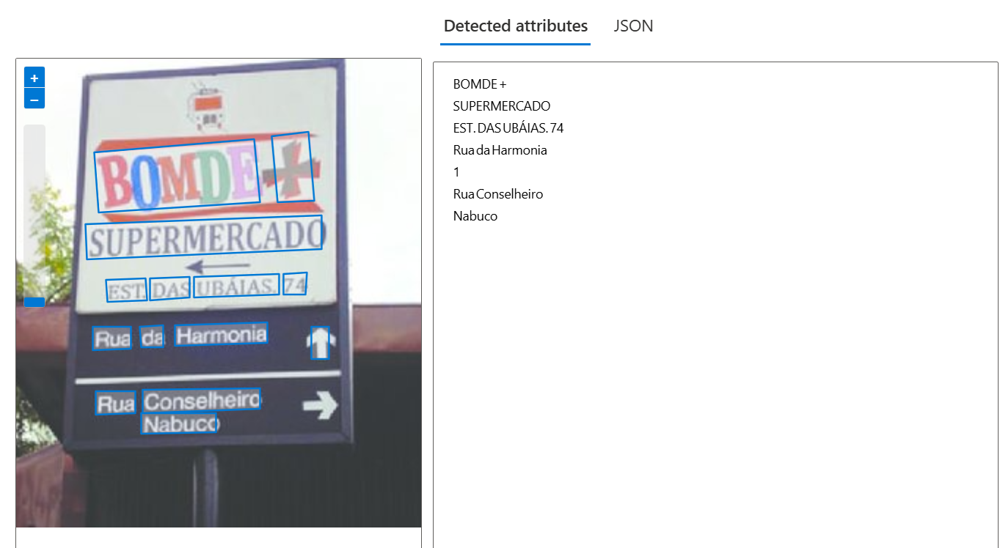

# Explorando os Recursos de IA Generativa com Copilot e OpenAI

## Passo a Passo

1. **Criar um serviço no Azure**  
   - Acesse o portal do Azure.
   - Crie um recurso do tipo "Azure AI Services".
   - Selecione a opção "Computer Vision".
   - Configure a região e camada de preços.
   - Gere e copie a chave da API e o endpoint fornecidos.

2. **Acessar o Vision Studio**  
   - Vá para o [Vision Studio](https://portal.vision.cognitive.azure.com/).
   - Selecione a opção **Extract text from images**.
   
3. **Fazer upload da imagem para análise**  
   - No Vision Studio, clique em "Upload" e selecione a imagem desejada.
   - Aguarde o processamento da IA.
   
4. **Observar e registrar os resultados**  
   - O sistema retorna o texto extraído da imagem.

## Resultados e Análises

### Exemplo 1

**Imagem:**  


**Texto Extraído:**  
```
BOMDE+
SUPERMERCADO
EST.DASUBÁIAS.74
RuadaHarmonia
1
RuaConselheiro
Nabuco
```

**Comentário:**  
Muito interessante o fato de que a IA disponibiliza um JSON com várias informações sobre a extração, como a posição exata de cada palavra. Neste caso, ela entendeu que uma seta para cima era um número 1.

### Exemplo 2

**Imagem:**  


**Texto Extraído:**  
```
RODOVIAPE-015
PAULISTACENTRO-
OLINDA
RODOVIABR-101-
RECIFE
ABREUELIMA-
```

**Comentário:**  
A tecnologia identificou que as palavras são separadas e onde estão cada uma delas na imagem. A IA reconheceu um símbolo de traço (-) ao analisar cada seta presente na placa.

### Exemplo 3

**Imagem:**  


**Texto Extraído:**  
```
PERIGO
ÁREASUJEITA
AATAQUE
DETUBARÃO
DANGER
BATHERSINTHISAREA
AREATAGREATER
THANAVERAGERISK
OFSHARKATTACK
```

**Comentário:**  
Extração bem sucedida das palavras presentes na placa.

## Insights e Aprendizados
- A tecnologia de OCR (Optical Character Recognition) da Azure é eficiente na maioria dos casos, mas pode apresentar dificuldades com fontes distorcidas ou símbolos diferentes.
- A precisão da extração de texto depende da qualidade da imagem e do contraste do texto em relação ao fundo.
- O Vision Studio facilita o teste de modelos sem necessidade de código.

